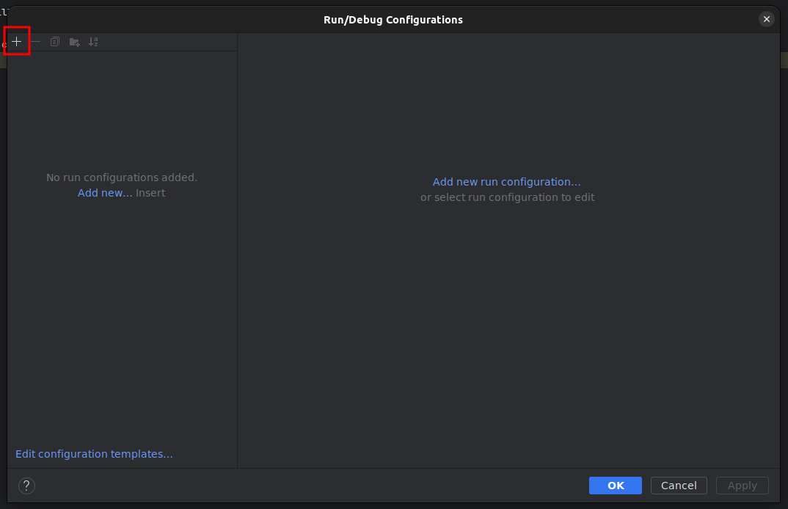
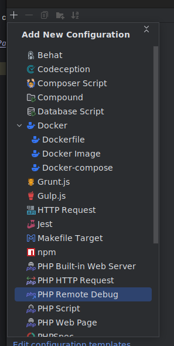
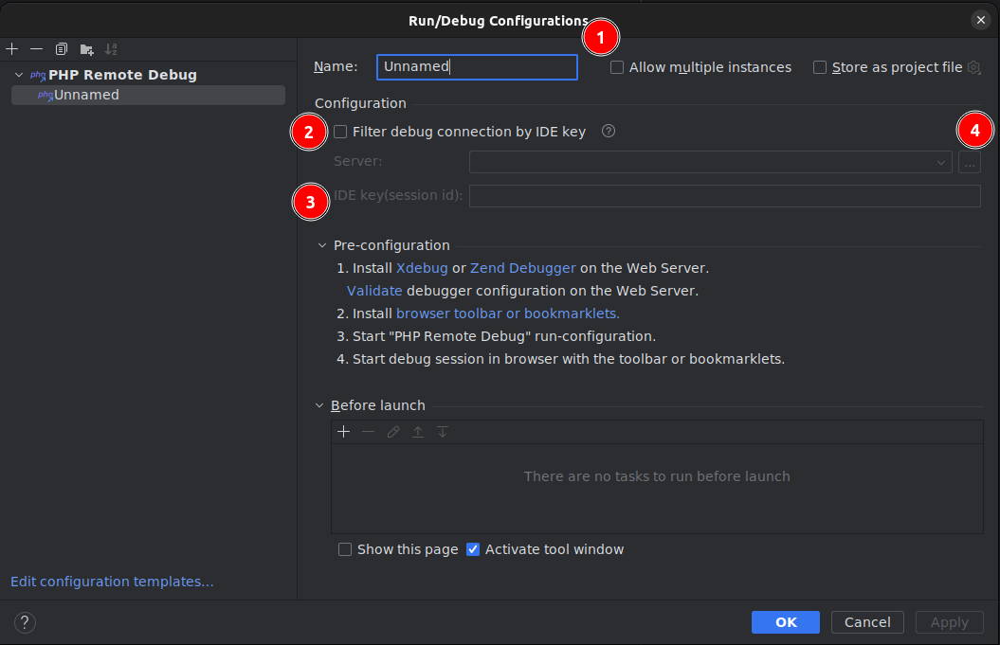
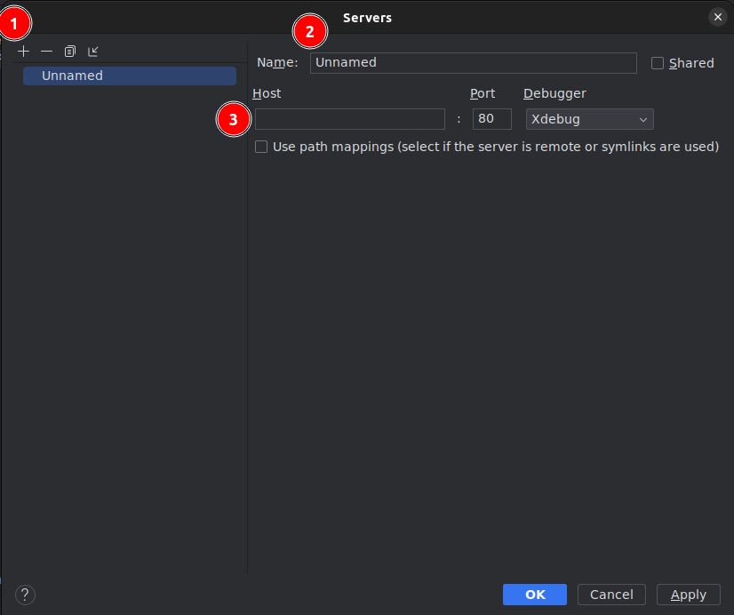
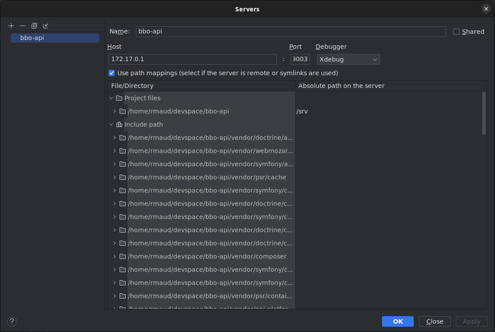
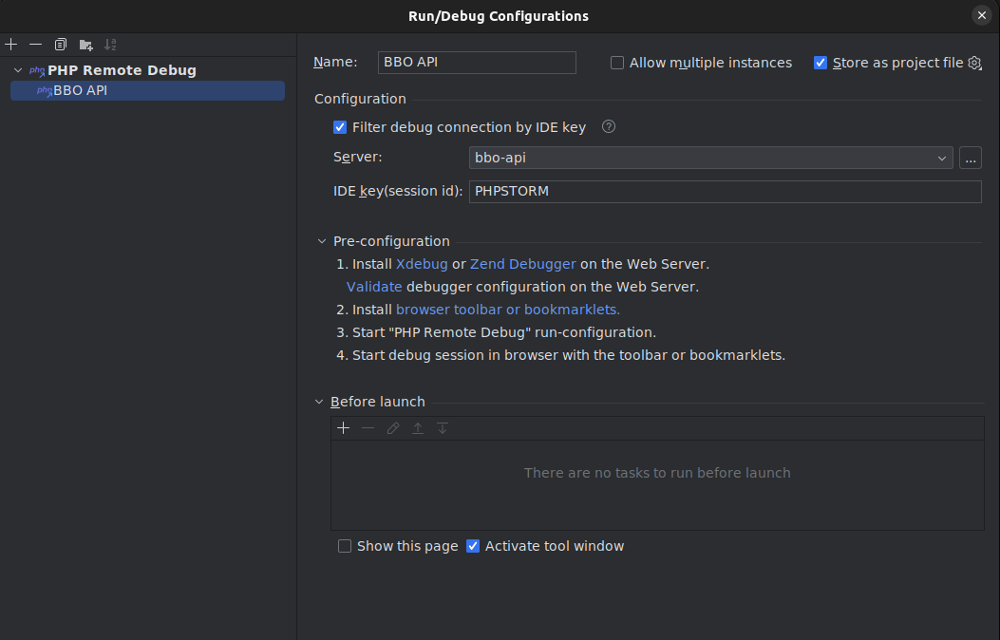
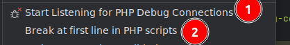
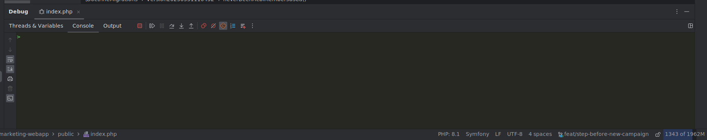
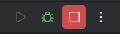
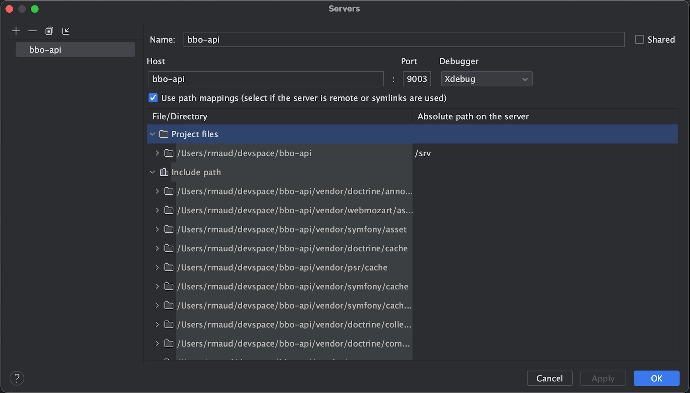

# XDEBUG

* [Linux](#linux)
* [MacOS](#macos)

Here, will explain how install xdebug on Phpstorm.

## Linux

1. Open config panel `Run > Edit Configurations`

2. Add new `PHP Remote Debug`

3. Set up the new remote debug by change :

   
(1) Config name, chose what you want (e.g., AFUP Web Debug)

(2) Check `Filter debug connection by IDE Key`

(3) Fill `IDE key (session id)` with the environment variable `XDEBUG_IDEKEY` in `docker.env.local` file (e.g `PHPSTORM`)

(4) Create server by clicking on `...`

4. Add new one (1) and set up with :

(2) Server name, the value is a part of environment variable `PHP_IDE_CONFIG`. For the env value `serverName=afup-web` use `afup-web` as server name.

(3) Use value of environment variable `LOCAL_IP` as host and `XDEBUG_PORT` as port

5. Check `Use path mappings` and add `/var/www/html` (The project folder in docker container) in front of project file. At the end, you need to have something like this :

And for remote debug config, something like this :

6. To check if the configuration works in menu `Run`, `Start Listening` (1) and `Break at first line` (2)

Don't forget to change the value of `XDEBUG_MODE` from `Off` to `debug,develop` before testing

8. Then, go to a project page in your browser, and you will see the page load without end. At this moment you will see on your phpstorm you have 2 clues to know xdebug work. (fig 1, 2)

*Fig 1*

*Fig 2*

:rotating_light: On your `docker.env.local` when you change a value you need to restart your docker.

## MacOS

1. Before follow the linux tuto, you need to replace in `docker.env.local`, the value of `LOCAL_IP` by `host.docker.internal`.
2. At the fourth step in linux tuto you need to use `PHP_IDE_CONFIG` serverName value as `Host`

*Final server config on MacOS*

